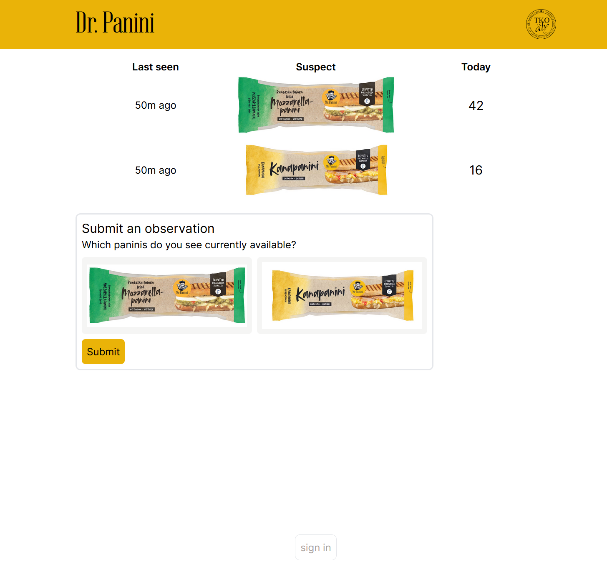

#  Dr. Panini

This is a simple app to try to crowdsource panini information.

## developing

The best way to run the app is the [tko-aly.localhost development environment](https://github.com/TKOaly/tko-aly.localhost).

If you do not have access, you will need to set up [user-service](https://github.com/TKOaly/user-service/) locally and configure docker-compose to use it.

### stack overview

`next.js` with `next-auth` configured to user-service, `minio` for storing images, `prisma` for database access, `react-query` `tailwindcss` for styling.

package manager `npm`, language `typescript`.

### credits

favicon by Joona Kauppila
